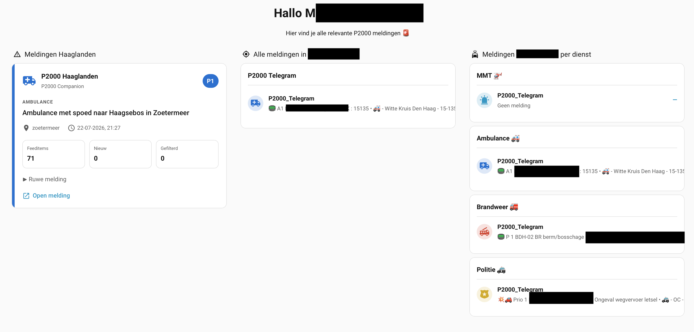
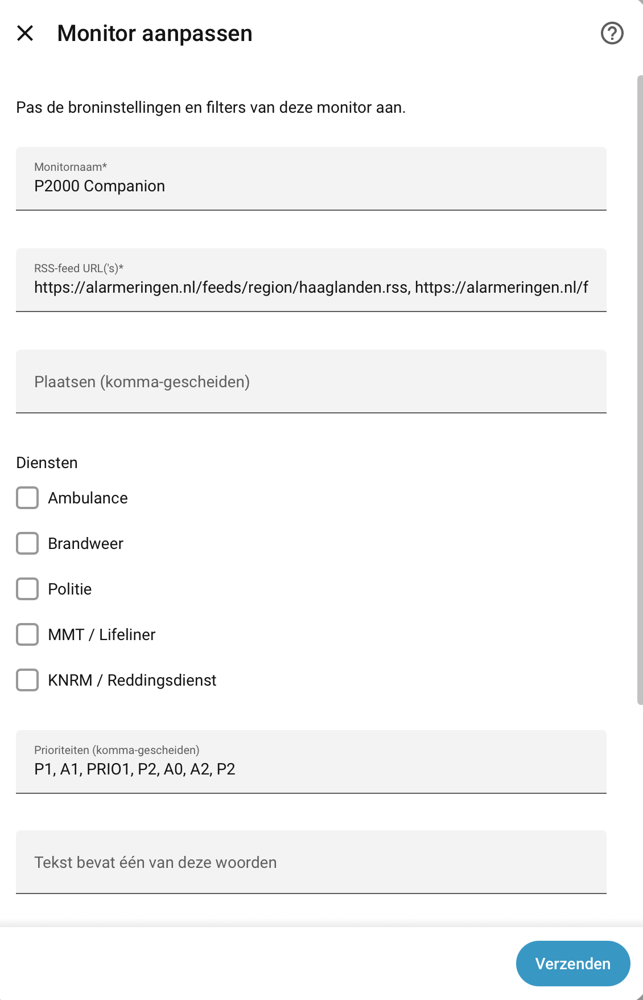

# 🚨 P2000 Companion

[](https://www.hacs.xyz/docs/faq/custom_repositories/)
[](https://github.com/kn8v7bf65h-art/homeassistant-p2000-companion/actions/workflows/validate.yml)
[](https://github.com/kn8v7bf65h-art/homeassistant-p2000-companion/releases)
[](LICENSE)

Receive, filter and automate Dutch **P2000 emergency alerts** directly inside Home Assistant.

P2000 Companion supports multiple providers, advanced filtering, real-time monitor events, Lovelace dashboard cards and powerful Home Assistant automations.

---

# Features

✅ RSS provider

Receive alerts directly from RSS feeds.

Supported examples:

- Alarmeringen.nl
- Regional feeds
- Custom RSS feeds

---

✅ Telegram provider

Receive alerts directly from Telegram channels using Telethon.

Supports:

- Private channels
- Public channels
- Multiple Telegram feeds
- Real-time events

---

✅ Multiple monitors

Create unlimited monitor profiles.

Examples:

- Ambulance Haaglanden
- Brandweer Westland
- Politie Den Haag
- MMT Zuid-Holland

Each monitor can have its own:

- Provider
- Feed
- Cities
- Services
- Priorities
- Text filters
- Excluded keywords

---

✅ Multiple providers

A monitor can use:

- RSS
- Telegram

Future providers are planned.

---

✅ Advanced filtering

Filter by:

- City
- Service
- Priority
- Keywords
- Excluded keywords

Supported priorities:

- P0
- P1
- P2
- P3
- B1
- B2

Supported services:

- Ambulance
- Brandweer
- Politie
- KNRM
- MMT

---

✅ Home Assistant events

Every monitor generates its own event.

Example:

```
p2000_monitor_ambulance_haaglanden
```

Perfect for automations.

---

✅ Dedicated sensors

Every monitor creates its own sensor.

Telegram monitors additionally remember the latest alert per service.

Example sensors:

```
sensor.ambulance_last_alert
sensor.brandweer_last_alert
sensor.politie_last_alert
sensor.mmt_last_alert
```

---

✅ Lovelace cards

Included custom dashboard cards:

- Incident Card
- Monitors Card

Supports:

- Icons
- Priority
- Time
- Friendly names
- Multiple entities
- Empty state
- Automatic updates

---

# Screenshots

## Dashboard



---

## Configuration



---

# Installation

## HACS

Add this repository as a Custom Repository.

Category:

```
Integration
```

Repository:

```
https://github.com/kn8v7bf65h-art/homeassistant-p2000-companion
```

Install via HACS.

Restart Home Assistant.

---

# Dashboard resource

The included Lovelace cards require one frontend resource.

Go to:

Settings

→ Dashboards

→ Resources

Add:

```
/p2000_companion/p2000-companion-card.js
```

Type:

```
JavaScript Module
```

Refresh your dashboard.

---

# Configuration

After installation:

Settings

→ Devices & Services

→ Add Integration

Select:

```
P2000 Companion
```

Choose your provider:

- RSS
- Telegram

---

# RSS provider

Configure:

- Feed URL
- Scan interval

Example:

```
https://alarmeringen.nl/feeds/region/haaglanden.rss
```

---

# Telegram provider

Configure:

- API ID
- API Hash
- Phone number
- Telegram session

P2000 Companion will automatically create a secure local session.

---

# Creating monitors

Each monitor can filter on:

- Provider
- Cities
- Services
- Priorities
- Include keywords
- Exclude keywords

---

# Automations

Example trigger:

```yaml
trigger:
  - platform: event
    event_type: p2000_monitor_ambulance_haaglanden
```

From there you can:

- speak alerts
- flash Hue lights
- send notifications
- trigger scripts
- start cameras
- anything Home Assistant supports

---

# Entities

Examples:

```
sensor.last_feed_alert
sensor.last_filtered_alert
sensor.ambulance_last_alert
sensor.brandweer_last_alert
sensor.politie_last_alert
sensor.mmt_last_alert
```

---

# Events

Example:

```
p2000_monitor_ambulance_haaglanden
```

Event data includes:

- summary
- city
- service
- priority
- timestamp
- raw message

---

# Troubleshooting

## Dashboard says:

```
Custom element doesn't exist
```

Check whether the dashboard resource has been added:

```
/p2000_companion/p2000-companion-card.js
```

---

## RSS works but Telegram doesn't

Verify:

- API ID
- API Hash
- Phone number
- Session
- Channel access

---

## No events

Verify:

- Monitor filters
- Feed URL
- Home Assistant logs

---

# Roadmap

Planned features:

- MQTT provider
- SDR provider
- Alert history
- Statistics
- Map support
- Incident details
- Export
- More dashboard cards

---

# Contributing

Bug reports and feature requests are welcome.

Please include:

- Home Assistant version
- P2000 Companion version
- Provider
- Relevant logs

---

# License

MIT License
